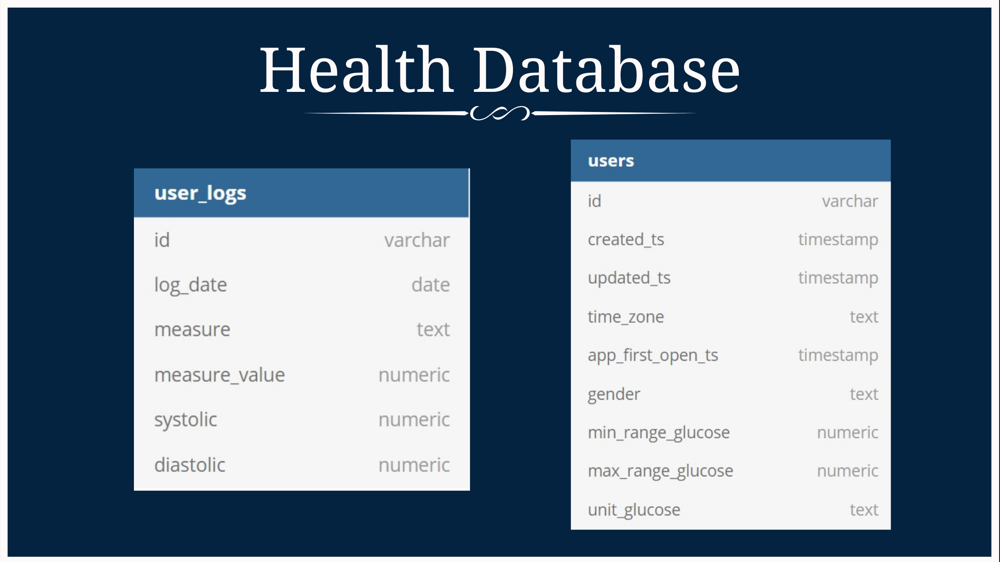
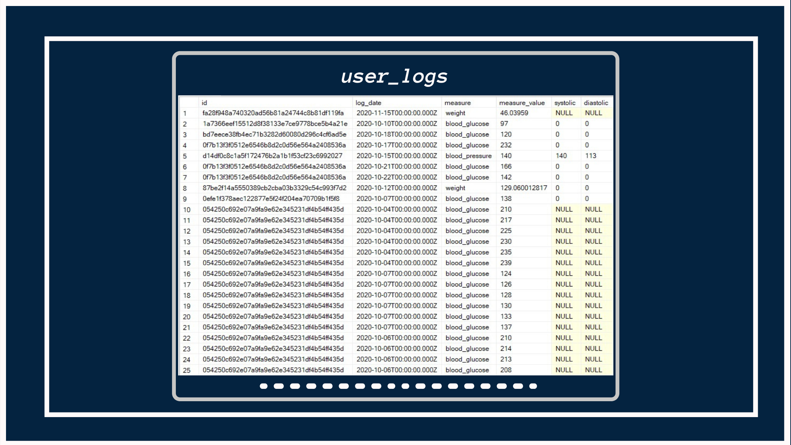

<h1 align="center">Health Analytics Mini Case Study</h1>


<p align="center">


</p>

##  About

This case study is part of the [Serious SQL](https://www.datawithdanny.com) course by [Danny Ma](https://www.linkedin.com/in/datawithdanny/).

<br>
<br>
<br>

##  Situation

We’ve just received an urgent request from the **General Manager** of *Analytics* at Health Co requesting our assistance with their analysis of the `health.user_logs` dataset.

##  Data
We have been provided with two table:
* `user_logs`
* `users`

<h4>user_logs</h4> 

This table contains the log of measurements values of different measures, like _blood glucose_, _blood pressure_ and _weight_, taken by various users at various periods in time.

The primary focus of this case study will be on the data present in `user_logs` table.



##  Sneak-peek at the Data



##  Business Questions

1. How many **unique users** exist in the logs dataset?
2. How many **total measurements** do we have **per user on average**?
3. What about the **median** number of measurements **per user**?
4. How many users have **3 or more measurements**?
5. How many users have **1,000 or more measurements**?

> Looking at the logs data - what is the number and percentage of the active user base who:

6. Have logged **`blood glucose`** measurements?
7. Have at least **2 types of measurements**?
8. Have all **3 measures** - `blood glucose`, `weight` and `blood pressure`?

> For users that have blood pressure measurements:
9. What is the **median** `systolic`/`diastolic` blood pressure values? 

##  Solutions


<br>

### How many unique users exist in the logs dataset?

```sql
SELECT
	COUNT(DISTINCT id) AS unique_users
FROM user_logs;
```


<br><br>

| unique_users   |
| :------------: |
|    554         |

---

### `NOTE`
> **For tackling Questions 2-8, we'll be creating a Temporary Table**

```sql
DROP TABLE IF EXISTS user_measure_count;
```

```sql
SELECT
    id,
    COUNT(*) AS measure_count,
    COUNT(DISTINCT measure) as unique_measures
INTO user_measure_count
FROM user_logs
GROUP BY id; 
```

---


<br>

### How many total measurements do we have per user on average?

```sql
SELECT
	ROUND(AVG(measure_count),2) AS avg_measurements
FROM user_measure_count;
```


<br><br>

| avg_measurements  |
| :---------------: |
|    79             |

---


<br>

### What about the median number of measurements per user?

```sql
SELECT
	 DISTINCT PERCENTILE_CONT(0.5) WITHIN GROUP (ORDER BY measure_count) OVER () AS median_measurement
FROM user_measure_count;
```


<br><br>

| median_measurement  |
| :---------------:   |
|    2               |

---


<br>

### How many users have 3 or more measurements?

```sql
SELECT
	COUNT(id) AS count_records
FROM user_measure_count
WHERE measure_count >= 3;
```


<br><br>

| count_records  |
| :----------:   |
|    209         |

---


<br>

### How many users have 1,000 or more measurements?

```sql
SELECT
	COUNT(id) AS count_records
FROM user_measure_count
WHERE measure_count >= 1000;
```


<br><br>

| count_records  |
| :----------:   |
|    5           |

---


<br>

### How many users have logged bood glucose measurements and percentage users when compared to other measures?

```sql
WITH active_users AS(
SELECT
	measure,
	COUNT(DISTINCT id) AS active_users,
	ROUND(
		100*CAST(COUNT(DISTINCT id) AS NUMERIC)/SUM(COUNT(DISTINCT id)) OVER(), 
		2
		) AS perc_active_users
FROM user_logs
GROUP BY measure
)
SELECT
	measure,
	active_users,
	CONCAT(SUBSTRING(CAST(perc_active_users  AS nvarchar),1,5),'%') AS perc_active_users
FROM  active_users
WHERE measure = 'blood_glucose';
```


<br><br>

| measure        | active_users | perc_active_users |
| :----------:   | :----------: | :---------------: |
| blood_glucose  | 325          | 40.22%            |

---


<br>

### Have atleast 2 types of measurements?

```sql
SELECT 
  COUNT(*) AS Count
FROM user_measure_count
WHERE unique_measures >= 2;
```


<br><br>

| Count      |
| :------:   |
|   204      |

---


<br>

### Have all 3 measures - blood glucose, weight and blood pressure?

```sql
SELECT
  COUNT(*) AS Count
FROM user_measure_count
WHERE unique_measures = 3;
```


<br><br>

| Count      |
| :------:   |
|   50       |

---


<br>

### What is the median systolic/diastolic blood pressure values?

```sql
SELECT
	DISTINCT PERCENTILE_CONT(0.5) WITHIN GROUP (ORDER BY CAST(systolic AS INT)) OVER() AS systolic_median
FROM user_logs
WHERE measure = 'blood_pressure';
```

```sql
SELECT
	DISTINCT PERCENTILE_CONT(0.5) WITHIN GROUP (ORDER BY CAST(diastolic AS INT)) OVER() AS diastolic_median
FROM user_logs
WHERE measure = 'blood_pressure';
```


<br><br>

| systolic_median  | 
| :-------------:  | 
|   126            | 

| diastolic_median | 
| :-------------:  | 
|   79             | 

---
